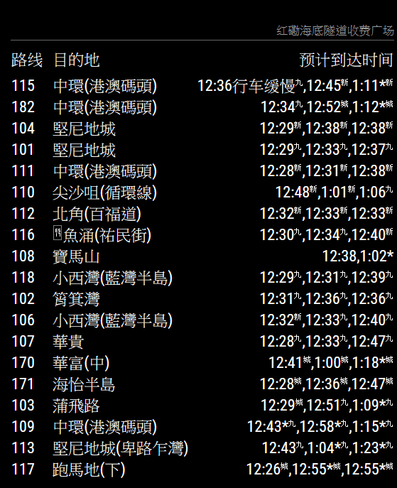

# MMM-HK-KMB
**Station monitor** for the **Hong Kong KMB**.

This module is an extension of the amazing [MagicMirror<sup>2</sup>](https://github.com/MichMich/MagicMirror) project by [MichMich](https://github.com/MichMich/) which has inspired me to share my coding skills with others as well. Check it out, you know you want to :).

It's always nice to see mirrors using my work, so feel free to send me some screenshots of your implementations.

Lastly, why not join in on our discussions at the official [MagicMirror<sup>2</sup> Forum](http://forum.magicmirror.builders/)?

## Reverse Engineering Process
I wrote an article on [Medium](https://medium.com/@winstonhyypia/the-making-of-mmm-hk-kmb-module-db6eb0181eb6) about the reverse engineering process. Hope you could enjoy.

## Screenshots

Here is the screenshots with different language settings:

* `en`

    

* `zh-tw`

    

* `zh-cn`

    


## Current version

v1.4.2

## Languages
As of version 1.4.2, MMM-HK-KMB features language support for `Traditional Chinese (zh-tw)`,  `Simplified Chinese (zh-cn)` and `English (en)`.

## Prerequisite
A working installation of [MagicMirror<sup>2</sup>](https://github.com/MichMich/MagicMirror)
 
## Dependencies
  * npm
  * [node-schedule](https://www.npmjs.com/package/node-schedule)
  * [got](https://www.npmjs.com/package/got)

## Installation
To add this module, go to MagicMirror folder and run the following command
```bash
cd modules
git clone https://github.com/winstonma/MMM-HK-KMB.git
cd MMM-HK-KMB
npm install
```

## Module behavior
Please note that this module auto-creates a module header which displays the name of the chosen Hong Kong local transport stop. It is therefore recommended not to add a 'header' entry to your config.js for this module.<P>
This module automatically disappears from your mirror as soon as a station has stopped offering connections at night. It reappears as soon as your chosen station is scheduled to be served again.<P>
This module has been programmed to allow for multiple instances. Simply add more MMM-HK-KMB config entries to your config.js file to display multiple stations and configure them according to your needs.

## Configuration
Sample minimum configuration entry for your `~/MagicMirror/config/config.js`:

    ...

    {
      module: 'MMM-HK-KMB',
      position: 'top_left',
      config: {
        stops: [
          {
            stopID: 'HO06-S-1250-0',		// Which stop would you like to have displayed?	
          }
        ]
      }
    } 						// If this isn't your last module, add a comma after the bracket
  
  ...

Sample configuration entry for your `~/MagicMirror/config/config.js` with optional parameters:

    ...

    {
      module: 'MMM-HK-KMB',
      position: 'top_left',
      config: {
        stops: [
          {
            stopID: 'HO06-S-1250-0',		// Which stop would you like to have displayed?	
          }
        ],
        inactiveRouteCountPerRow: 0,   // how many inactive route would be displayed, 0 means hide all inactive route
        labelRow: true, // Show or hide column headers
        reload: 60000 	// How often should the information be updated? (In milliseconds)
      }
    } 						// If this isn't your last module, add a comma after the bracket

    ...

## Find the `stopID`
1. Open your web browser and navigate to the [kmb-lwb-combined-headway-eta](http://kmb_eta.csproject.org/) page, developed by miklcct.
2. In the `Enter the route number:` box, enter the KMB Bus route number that passes the stop. Then press the submit button. The destination and the home would be displayed.
3. After the submit of bus route, the route origin and destination would be displayed. Choose the right diretcion by clicking `Switch direction` button.
4. In the `Choose a route variant:` infobox, select the variant.
5. In the `Choose a stop in the list:` infobox, there is a list of stop with the `stopID` displayed in bracket. Fill the `stopID` in the `config.js`.

## Config Options
| **Option** | **Default** | **Description** |
| :---: | :---: | --- |
| stopID | HO06-S-1250-0 | <BR>Which stop would you like to have displayed? <BR><EM> Default: HO06-S-1250-0</EM><P> |
| labelRow<BR>`optional` | true | <BR> Show or hide column headers<BR> <EM>Possible values: true, false</EM><P> |
| reload<BR>`optional`  | 60000 | <BR> How often should the information be updated? (In milliseconds) <BR><EM> Default: Every minute </EM><P> |

## Acknowledgement
This project is possible only when given the code [kmb-lwb-combined-headway-eta](https://github.com/miklcct/kmb-lwb-combined-headway-eta), which is developed by miklcct.
Last but not least, I would like to dedicate my thanks to AlvinHKH, who implement working Android implementation [BusETA](https://github.com/alvinhkh/buseta).