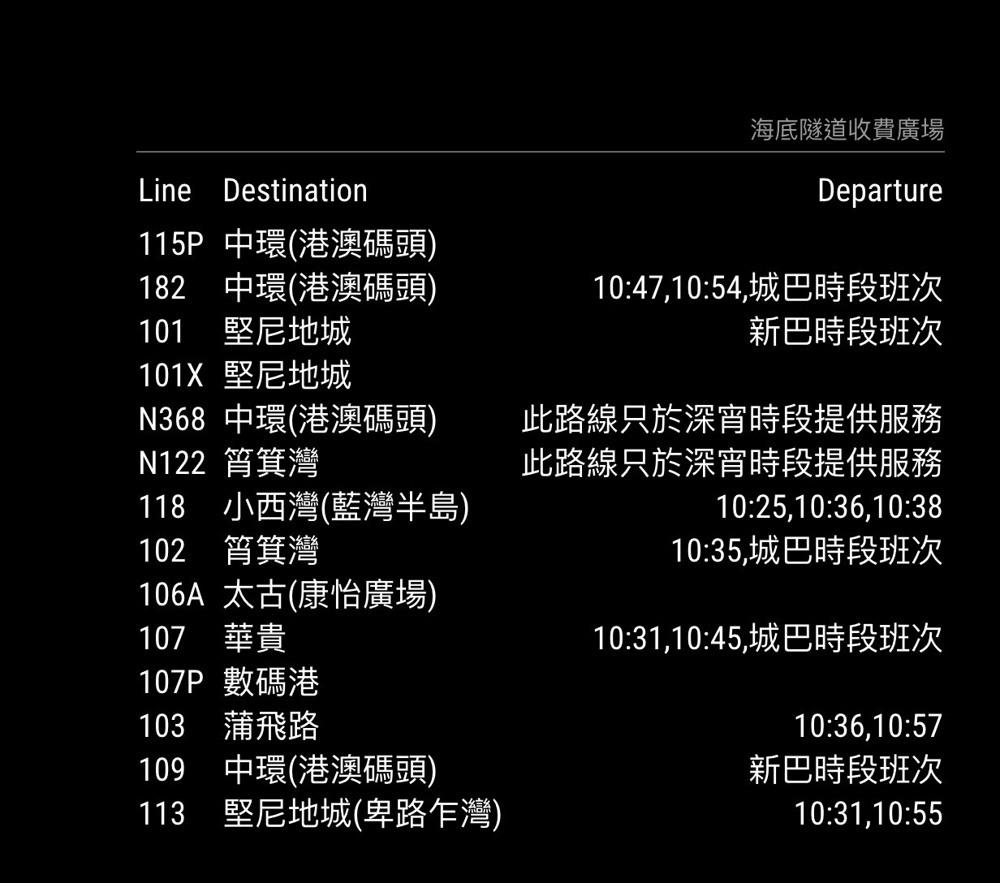

# MMM-HK-Transport
<B>Station monitor</B> for the <B>Hong Kong Transport</B>.

This module is an extension of the amazing [MagicMirror2](https://github.com/MichMich/MagicMirror) project by [MichMich](https://github.com/MichMich/) which has inspired me to share my coding skills with others as well. Check it out, you know you want to :). 

It's always nice to see mirrors using my work, so feel free to send me some screenshots of your implementations.

Lastly, why not join in on our discussions at the official [MagicMirror2 Forum](http://forum.magicmirror.builders/)?

## Screenshots

## Current version

v1.0.0

## Languages
As of version 1.0.0, MMM-HK-Transport features language support for `Chinese (zh)` and `English (en)` mirrors.

## Prerequisite
A working installation of [MagicMirror2](https://github.com/MichMich/MagicMirror)
 
## Dependencies
  * npm
  * [request](https://www.npmjs.com/package/request)

## Installation
1. Navigate into your MagicMirror's `modules` folder.
2. Execute `git clone https://github.com/winstonma/MMM-HK-Transport.git`.
3. Execute `cd MMM-HK-Transport`.
3. Execute `npm install`.

## Module behavior
Please note that this module auto-creates a module header which displays the name of the chosen Hong Kong local transport stop. It is therefore recommended not to add a 'header' entry to your config.js for this module.

This module automatically disappears from your mirror as soon as a station has stopped offering connections at night. It reappears as soon as your chosen station is scheduled to be served again.

This module has been programmed to allow for multiple instances. Simply add more MMM-HK-Transport config entries to your config.js file to display multiple stations and configure them according to your needs.

## Configuration
Sample minimum configuration entry for your `~/MagicMirror/config/config.js`:

    ...
    
    {
        module: 'MMM-HK-Transport',
        position: 'top_left',
        config: {
            stopID: 'HKStop_KowloonCentralPostOffice_N_3_1',		// Which stop would you like to have displayed?	
            stopName: '九龍中央郵政局'	
        }
    } 						// If this isn't your last module, add a comma after the bracket
    
    ...

Sample configuration entry for your `~/MagicMirror/config/config.js` with optional parameters:

    ...
    
    {
        module: 'MMM-HK-Transport',
        position: 'top_left',
        config: {
            stopID: '',     // Which stop would you like to have displayed?
            stopName: '',   // How would you want the stop name be displayed? 
            labelRow: true, // Show or hide column headers
            reload: 60000 	// How often should the information be updated? (In milliseconds)
        }
    } 						// If this isn't your last module, add a comma after the bracket
    
    ...

## Figuring out the correct stopID
1. Open your web browser and navigate to the [CityMapper Hong Kong Web Page](https://citymapper.com/hong-kong).
2. Use the search field to find the Line that the stop will stopped.
3. Once you can see the stop in your browser, click the stop.
4. When a new page is being displayed, check the link (e.g. https://citymapper.com/hong-kong/bus/stops/HKStop_KowloonCentralPostOffice_N_3_1). Note the last portion of the link (e.g. HKStop_KowloonCentralPostOffice_N_3_1)is the `StopID` you are looking for.

## Config Options
| **Option** | **Default** | **Description** |
| :---: | :---: | --- |
| stopID | HKStop_KowloonCentralPostOffice_N_3_1 |  Which stop would you like to have displayed?  <EM> Default: HKStop_KowloonCentralPostOffice_N_3_1</EM>
 |
| stopName | Stop |  How would you want the stop name be displayed?  <EM> Default: Stop</EM>
 |
| labelRow `optional` | true |   Show or hide column headers  <EM>Possible values: true, false</EM>
 |
| reload `optional`  | 60000 |   How often should the information be updated? (In milliseconds)  <EM> Default: Every minute </EM>
 |

## Licence
MIT License

Copyright (c) 2016 Winston (https://github.com/winstonma/)

Permission is hereby granted, free of charge, to any person obtaining a copy
of this software and associated documentation files (the "Software"), to deal
in the Software without restriction, including without limitation the rights
to use, copy, modify, merge, publish, distribute, sublicense, and/or sell
copies of the Software, and to permit persons to whom the Software is
furnished to do so, subject to the following conditions:

The above copyright notice and this permission notice shall be included in all
copies or substantial portions of the Software.

THE SOFTWARE IS PROVIDED "AS IS", WITHOUT WARRANTY OF ANY KIND, EXPRESS OR
IMPLIED, INCLUDING BUT NOT LIMITED TO THE WARRANTIES OF MERCHANTABILITY,
FITNESS FOR A PARTICULAR PURPOSE AND NONINFRINGEMENT. IN NO EVENT SHALL THE
AUTHORS OR COPYRIGHT HOLDERS BE LIABLE FOR ANY CLAIM, DAMAGES OR OTHER
LIABILITY, WHETHER IN AN ACTION OF CONTRACT, TORT OR OTHERWISE, ARISING FROM,
OUT OF OR IN CONNECTION WITH THE SOFTWARE OR THE USE OR OTHER DEALINGS IN THE
SOFTWARE.
